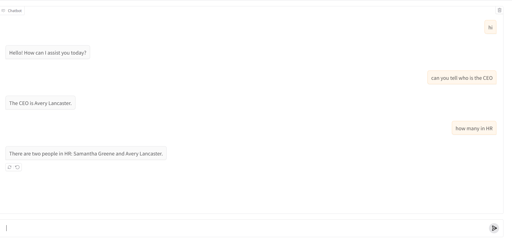

# Insurellm RAG-based Chat System

An intelligent conversational AI system for Insurellm, an insurance tech company, that uses Retrieval-Augmented Generation (RAG) to provide accurate information about company products, employees, contracts, and operations.



## Overview

This project implements a sophisticated question-answering system that combines the power of Large Language Models (LLMs) with a comprehensive knowledge base using RAG architecture. The system allows users to interact with Insurellm's organizational knowledge through natural language conversations.

## Problem Statement

### What Problem Does This Solve?

**1. Information Access Challenges:**
- **Scattered Knowledge**: Insurellm's organizational knowledge is distributed across multiple documents covering products (Carllm, Homellm, Rellm, Markellm), employee records, contracts, and company information
- **Manual Search Inefficiency**: Finding specific information requires manual searching through numerous markdown files across different categories
- **Context Understanding**: Traditional search can't understand context or answer complex questions that require information synthesis

**2. Solution Provided:**
- **Intelligent Query Processing**: Natural language interface that understands questions and retrieves relevant information
- **Context-Aware Responses**: Maintains conversation history to provide coherent, contextual answers
- **Unified Knowledge Access**: Single interface to query all organizational knowledge including products, contracts, employees, and company details
- **Real-time Information Retrieval**: Fast semantic search through vector embeddings for accurate information retrieval

## AI Component Integration

### How the AI is Integrated

The application integrates AI at multiple levels:

**1. Embedding Model Integration:**
```python
from langchain_openai import OpenAIEmbeddings
from langchain_ollama import OllamaEmbeddings

# Converts text into vector representations
embeddings = OpenAIEmbeddings()  # or OllamaEmbeddings() for local models
```

**2. Language Model Integration:**
```python
from langchain_openai import ChatOpenAI

# GPT-4o-mini for natural language understanding and generation
llm = ChatOpenAI(temperature=0.7, model_name='gpt-4o-mini')
```

**3. Conversational Chain:**
```python
from langchain.chains import ConversationalRetrievalChain
from langchain.memory import ConversationBufferMemory

# Memory for maintaining conversation context
memory = ConversationBufferMemory(memory_key='chat_history', return_messages=True)

# Complete RAG chain combining LLM, retriever, and memory
conversation_chain = ConversationalRetrievalChain.from_llm(
    llm=llm,
    retriever=retriever,
    memory=memory
)
```

**4. User Interface Integration:**
```python
import gradio as gr

def chat(message, history):
    result = conversation_chain.invoke({"question": message})
    return result["answer"]

# Web-based chat interface
gr.ChatInterface(chat, type="messages").launch()
```

### Architecture Components

1. **Frontend Layer**: Gradio-based web interface for user interaction
2. **Application Layer**: LangChain orchestration managing conversation flow
3. **AI Layer**: OpenAI GPT models for language understanding and generation
4. **Storage Layer**: Chroma vector database for semantic search
5. **Data Layer**: Markdown-based knowledge base organized by categories

## Data Retrieval Architecture (RAG Implementation)

### How RAG Works in This Application

**1. Document Loading:**
```python
from langchain.document_loaders import DirectoryLoader, TextLoader

# Load all markdown files from knowledge base directories
folders = glob.glob("knowledge-base/*")
loaders = [
    DirectoryLoader(folder, glob="**/*.md", loader_cls=TextLoader, 
                   loader_kwargs={'encoding': 'utf-8'})
    for folder in folders
]
documents = [doc for loader in loaders for doc in loader.load()]
```

**2. Text Chunking:**
```python
from langchain.text_splitter import RecursiveCharacterTextSplitter

# Split documents into manageable chunks
text_splitter = RecursiveCharacterTextSplitter(
    chunk_size=1000,
    chunk_overlap=200
)
chunks = text_splitter.split_documents(documents)
```

**3. Vector Embedding & Storage:**
```python
from langchain_chroma import Chroma

# Create vector database with embeddings
vectorstore = Chroma.from_documents(
    documents=chunks,
    embedding=embeddings,
    persist_directory="vector_db"
)
```

**4. Query Processing Flow:**

```
User Query → Embedding → Similarity Search → Context Retrieval → LLM → Response
     ↓                                              ↓
 "Who is Emily?"                        Employee records → GPT-4 → "Emily Carter is 
                                        Product info       ↓        an Account Executive
                                        Chat history              in Austin, TX..."
```

### RAG Components

1. **Knowledge Base Structure:**
   ```
   knowledge-base/
   ├── company/       # Company information (about, careers, overview)
   ├── products/      # Product details (Carllm, Homellm, Rellm, Markellm)
   ├── employees/     # HR records and employee information
   └── contracts/     # Client contracts and agreements
   ```

2. **Vector Database (Chroma):**
   - Stores document embeddings for fast semantic search
   - Persisted in `vector_db/` directory
   - Enables similarity-based retrieval

3. **Retriever:**
   - Converts user questions into embeddings
   - Searches vector database for relevant document chunks
   - Returns top-k most similar documents as context

4. **Conversation Memory:**
   - Maintains chat history
   - Provides context for follow-up questions
   - Enables coherent multi-turn conversations

## Features

- **Natural Language Queries**: Ask questions in plain English about any aspect of Insurellm
- **Multi-Domain Knowledge**: Covers products, employees, contracts, and company information
- **Context-Aware**: Remembers conversation history for follow-up questions
- **Real-Time Responses**: Fast retrieval and generation using vector search
- **Web Interface**: User-friendly Gradio chat interface accessible via browser
- **Flexible AI Backend**: Supports both OpenAI and Ollama (local) models
- **Comprehensive Knowledge Base**: Includes detailed information on:
  - 4 insurance products (Carllm, Homellm, Rellm, Markellm)
  - Employee records with career history and compensation
  - Client contracts and partnerships
  - Company history and operations

## Technology Stack

### Core Dependencies

- **LangChain** (0.3.26): Framework for LLM application development
- **LangChain-OpenAI** (0.3.27): OpenAI model integration
- **LangChain-Chroma** (0.2.4): Vector database integration
- **LangChain-Community** (0.3.27): Additional LangChain components
- **LangChain-Ollama** (0.3.3): Local LLM support

### AI & ML Libraries

- **OpenAI** (1.93.0): GPT model API
- **NumPy** (2.3.1): Numerical computing
- **Pandas** (2.3.0): Data manipulation
- **scikit-learn** (1.7.0): Machine learning utilities (t-SNE for visualization)

### Interface & Visualization

- **Gradio** (5.35.0): Web-based chat interface
- **Matplotlib** (3.10.3): Plotting and visualization
- **Plotly** (6.2.0): Interactive visualizations
- **IPyWidgets** (8.1.7): Jupyter notebook widgets

### Development Tools

- **JupyterLab** (4.4.4): Interactive development environment
- **IPyKernel** (6.29.5): Jupyter kernel
- **python-dotenv** (1.1.1): Environment variable management

## Project Structure

```
rag/
├── knowledge-base/           # Document repository
│   ├── company/             # Company information
│   ├── products/            # Product documentation
│   ├── employees/           # HR records
│   └── contracts/           # Client contracts
├── vector_db/               # Chroma vector database (generated)
├── lab_1.ipynb             # Basic chat implementation
├── lab_2.ipynb             # Document loading and chunking
├── lab_3.ipynb             # Complete RAG system with UI
├── main.py                 # Main application entry point
├── requirements.txt        # Python dependencies
├── pyproject.toml          # Project configuration
└── README.md               # This file
```

## Setup and Installation

### Prerequisites

- Python 3.13 or higher
- OpenAI API key (for GPT models)
- Ollama (optional, for local LLM support)

### Installation Steps

1. **Clone the repository:**
   ```bash
   git clone https://github.com/rahmanshah/rag.git
   cd rag
   ```

2. **Create a virtual environment:**
   ```bash
   python -m venv venv
   source venv/bin/activate  # On Windows: venv\Scripts\activate
   ```

3. **Install dependencies:**
   ```bash
   pip install -r requirements.txt
   ```
   
   Or using uv (recommended):
   ```bash
   uv sync
   ```

4. **Set up environment variables:**
   Create a `.env` file in the project root:
   ```env
   OPENAI_API_KEY=your_openai_api_key_here
   ```

5. **Initialize the vector database:**
   Run `lab_2.ipynb` or `lab_3.ipynb` to create the vector database from the knowledge base.

## Usage

### Running the Chat Interface

1. **Using Jupyter Notebook:**
   ```bash
   jupyter lab
   ```
   Open `lab_3.ipynb` and run all cells to launch the Gradio interface.

2. **The chat interface will:**
   - Load all documents from the knowledge base
   - Create embeddings and store in Chroma vector database
   - Launch a web interface (typically at `http://127.0.0.1:7860`)
   - Accept natural language questions about Insurellm

### Example Queries

- "What products does Insurellm offer?"
- "Tell me about Emily Carter's career progression"
- "What is Carllm and how much does it cost?"
- "What contracts does Insurellm have with insurance companies?"
- "What is Insurellm's 2025 roadmap for Homellm?"
- "Who founded Insurellm and when?"

### Development Workflow

The project includes three progressive labs:

1. **lab_1.ipynb**: Basic implementation with manual context building
2. **lab_2.ipynb**: Automated document loading and text splitting
3. **lab_3.ipynb**: Complete RAG system with vector database and chat UI

## Knowledge Base Structure

The knowledge base contains markdown files organized into four categories:

### Company Information
- `about.md`: Company history and founding
- `overview.md`: Current operations and structure
- `careers.md`: Career opportunities

### Products
- `Carllm.md`: Auto insurance product
- `Homellm.md`: Home insurance product
- `Rellm.md`: Reinsurance product
- `Markellm.md`: Insurance marketplace product

### Employees
Individual markdown files for each employee containing:
- Job title and location
- Career progression at Insurellm
- Performance history
- Compensation details

### Contracts
Partnership agreements with insurance companies for each product line.

## How It Works

1. **Initialization**: Documents are loaded from `knowledge-base/` and split into chunks
2. **Embedding**: Each chunk is converted to a vector using OpenAI embeddings
3. **Storage**: Vectors are stored in Chroma database for fast retrieval
4. **Query Processing**: User questions are converted to embeddings
5. **Retrieval**: Most similar document chunks are retrieved from vector database
6. **Generation**: Retrieved context + query + chat history → GPT-4 → Response
7. **Display**: Answer is shown in the Gradio chat interface

## Advanced Features

### Vector Database Visualization

The project includes t-SNE visualization of the vector space:
```python
from sklearn.manifold import TSNE
import plotly.graph_objects as go

# Visualize embeddings in 2D space
tsne = TSNE(n_components=2, random_state=42)
embeddings_2d = tsne.fit_transform(embeddings)
```

### Multi-Model Support

Switch between OpenAI and local Ollama models:
```python
# OpenAI (cloud-based)
embeddings = OpenAIEmbeddings()
llm = ChatOpenAI(model_name='gpt-4o-mini')

# Ollama (local)
embeddings = OllamaEmbeddings()
llm = OllamaLLM(model='llama2')
```

## Contributing

Contributions are welcome! Areas for improvement:
- Add more documents to the knowledge base
- Implement additional retrieval strategies
- Add authentication and user management
- Deploy as a production web service
- Add support for additional file formats (PDF, DOCX)

## License

This project is part of an educational demonstration of RAG technology.

## Acknowledgments

- Built with [LangChain](https://langchain.com/) framework
- Powered by [OpenAI](https://openai.com/) GPT models
- Vector storage by [Chroma](https://www.trychroma.com/)
- UI by [Gradio](https://gradio.app/)
